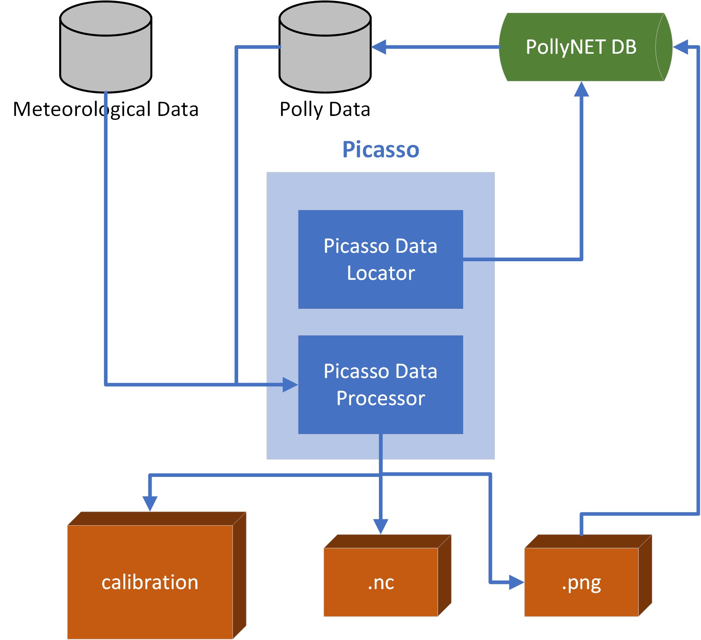

Usage
=====

Picasso can be applied in processing Polly data for individual Polly Data file (offline) or in an full automatic way (online). These two different applications are described in the sections below.

Offline Mode
------------

After Picasso was downloaded and all relevant configurations had been added, it's time to process the data with Picasso.

.. code-block:: matlab

    cd /path/to/Picasso
    initPicassoToolbox    % add Picasso into Matlab search path

    picassoProcV3('/path/to/2019_03_22_Fri_ARI_18_00_02.nc', 'arielle', '/path/to/pollynet_processing_chain_config.json')

After running Picasso, the figure and products will be created under the respective paths that were specified in **Picasso Configuration** file.

Online Mode
-----------

**Online Mode** is used for processing `PollyNET`_ data automatically. It needs dedicated **PollyNET DB** for data querying and saving.

    Online Mode of Picasso

.. note::
    Online Mode is only applicable under the help of core developers!!! For anyone needs to process batched polly data, you can follow the instructions in `Offline Mode`_ mode.

.. _PollyNET: https://polly.tropos.de/