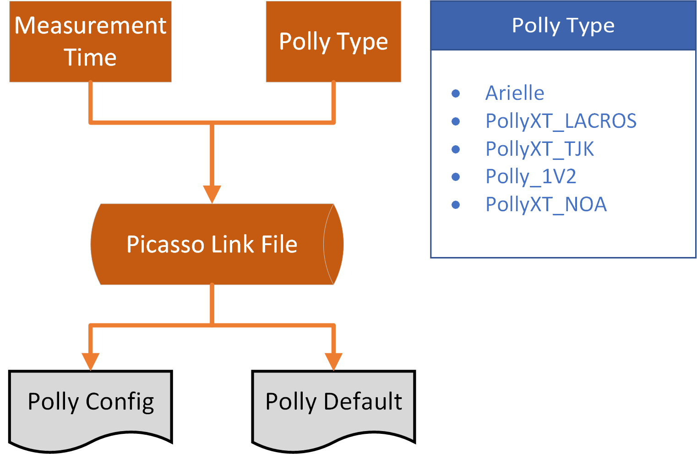

Picasso Configurations
======================

There are many features in Picasso and they can be switched on/off according to the configurations. These configurations can be divided into four parts: 

- **Global Configurations**: valid for all processing tasks.
- **Picasso Link File**: entries for **Polly Configurations** and **Polly Defaults**.
- **Polly Configurations**: valid for single Polly or campaign.
- **Polly Defaults**: valid for single Polly and campaign.

These three configurations are the basics for using Picasso properly.

Global Configurations
---------------------

**Global Configurations** are mainly associated with paths, folders and figure qualities. Below is the default settings for **Global Configurations**:

.. code-block:: json

    {
    "fileinfo_new": "",
    "doneListFile": "",
    "polly_config_folder": "",
    "log_folder": "",
    "gdas1_folder": "",
    "defaultFile_folder": "",
    "results_folder": "",
    "pic_folder": "",
    "pollynet_config_link_file": "",

    "printLevel": 0,
    "figDPI": 150,
    "fontname": "DejaVu Serif",

    "minDataSize": 500000,

    "institute": "Ground-based Remote Sensing Group (TROPOS)",
    "homepage": "http://polly.rsd.tropos.de/",
    "contact": "Zhenping Yin <zhenping@tropos.de>",

    "pyBinDir": "",

    "flagEnableLogSubFolder": false,
    "flagRenewLogFile": false,
    "flagDeleteData": false,
    "flagDeletePreOutputs": true,
    "flagEnableCaliResultsOutput": true,
    "flagEnableResultsOutput": true,
    "flagEnableDataVisualization": true,	
    "flagDebugOutput": true,
    "flagReduceMATLABToolboxDependence": false,
    "flagSendNotificationEmail": false,
    "flagWatermarkOn": true
    }

The **Global Configurations** can be overridden by setting up a new .json_ file or just editing the `template` file in **config**. The details of each keyword can be found below:

.. csv-table:: Picasso global configurations
   :widths: 15 40 20
   :header: "Keyword", "Meaning", "Example"
   :file: ../_static/Picasso_global_config.csv

Picasso Link File
-----------------

       Picasso Link File.

**Picasso Link File** is the logbook for different campaigns and can be used to search **Polly Configurations** and **Polly Defaults** for different polly data. `Picasso Link File <https://github.com/PollyNET/Pollynet_Processing_Chain/blob/v3.0/config/template_pollynet_processing_chain_config_links.xlsx>`_ contains basic information about campaigns and assigns **Polly Configuration** file and **Polly Defaults** file. If a new campaign was ready, the relevant information of this campaign should be added into **Picasso Link File** in case the campaign data can be processed.

.. note::

    If no entry for the polly data can be found, Picasso will jump over the current data.

Polly Configurations
--------------------

**Polly Configurations** can be specified for each polly data. They control how data was pre-processed, the thresholds of retrievals and aerosol/cloud classifications, boundaries for data visualization, etc. The **Polly Configurations** can be overridden by setting up a new .json_ file. The details of each keyword can be found below:

.. csv-table:: Polly configurations
    :widths: 15 40 20 20
    :header: "Keyword", "Meaning", "Example", "Reference"
    :file: ../_static/polly_config.csv

Rayleigh fit configurations
^^^^^^^^^^^^^^^^^^^^^^^^^^^

There are two steps for `Rayleigh fit algorithm <../_static/Picasso_Rayleigh_fit_algorithm.pptx>`_ implemented in Picasso:

- Signal de-composition by `Douglas-Peucker algorithm`_
- Rayleigh fit on each signal segments (de-composed by step **1**)

To obtain required reference height in terms of reference height width and SNR, there are 7 configurations applied:

1. decomSmoothWin{wavelength}
2. maxDecomHeight{wavelength}
3. maxDecomThickness{wavelength}
4. minDecomLogDist{wavelength}
5. minRefThickness{wavelength}
6. minRefSNR{wavelength}
7. minRefDeltaExt{wavelength}

The first 4 parameters are associated with signal de-composition. Before the signal de-composition, range-corrected signal is first divided by Rayleigh signal to correct signal attenuation by molecules and then is smoothed to remove signal spikes caused by signal noise. The smoothing window width is controlled by `decomSmoothWin`. The larger the smoothing window width, the more likely suitable reference height can be found. But it should be noted that signal smoothing would remove weak signal features and make them de-composed wrongly. Therefore, one may need to tune this parameter to get more reliable reference height.

During the signal de-composition, the signal was decomposed according to the required maximum distance of all points to the line determined by start/end point of each signal segment. It would ensure that every signal segment is close to a line with maximum deviation less than maximum distance, configured by `maxDecomLogDist`. The smaller the maximum distance, the narrower the signal segments. Besides, `maxDecomHeight` and `maxDecomThickness` control the top boundary of signal de-composition and maximum length of signal segments, which would determine the top boundary of Rayleigh fit and final width of reference height.

After the signal de-composition, the signal segments are fed into Rayleigh fit algorithm. The Rayleigh fit criteria are applied for each signal segment to choose suitable reference height. The criteria includes:

1. minimum reference height width (controlled by `minRefThickness`)
2. near- and far-range test
3. White-noise test
4. SNR test (controlled by `minRefSNR`)
5. Slope test (Pure Rayleigh test controlled by `minRefDeltaExt`)

`minRefThickness` is the parameter to control the width of reference height. It should be at least larger than 500 m to fulfill criterion **3** of requirement for minimum SNR. `minRefDeltaExt` is a key parameter to control the similarity between lidar signal and Rayleigh signal (Details can be found in `Picasso_Rayleigh_fit_algorithm.pptx <../_static/Picasso_Rayleigh_fit_algorithm.pptx>`_). Usually, this should be fixed to 1.

Polly Defaults
--------------

Polly defaults are used for configuring the processing program, when the calibration procedure fails. At present stage, there are 3 calibration procedures which are essential for the program: lidar constants, depolarization calibration constant and water vapor calibration constant. Besides, the overlap file is also recommended to be attached to compare with the estimated overlap function through the signal ratio between Near-Range (NR) and Far-Range (FR) channels. In general, different polly systems have their own specific default settings because of their different functionalities. Old polly system has less channels, which in the end would require less calibration procedures and thus less default settings. The most advanced polly system, like the arielle, has been powered with 13 channels, namely :math:`3\beta+2\alpha+2\delta+WV`, which needs more efforts for retrieving the products. Details of the default settings can be found below:

.. csv-table:: Polly defaults
    :widths: 15 40 20 20
    :header: "Keyword", "Meaning", "Type", "Example"
    :file: ../_static/polly_defaults.csv

.. _json: https://www.json.org/json-en.html
.. _Douglas-Peucker algorithm: https://en.wikipedia.org/wiki/Ramer%E2%80%93Douglas%E2%80%93Peucker_algorithm