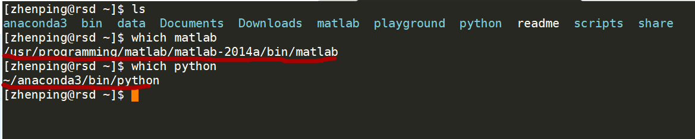
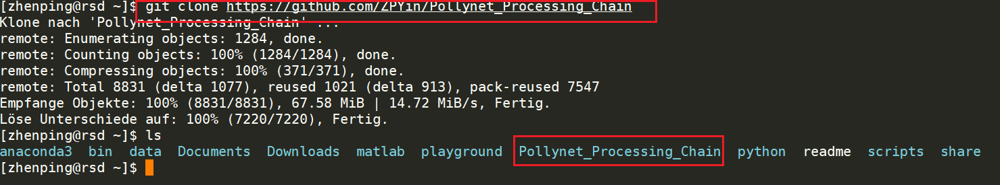
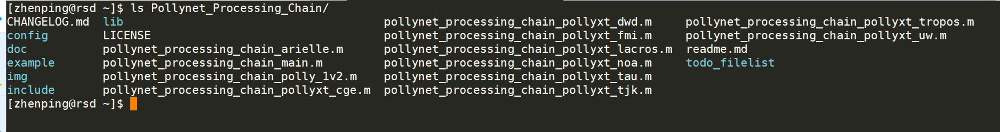
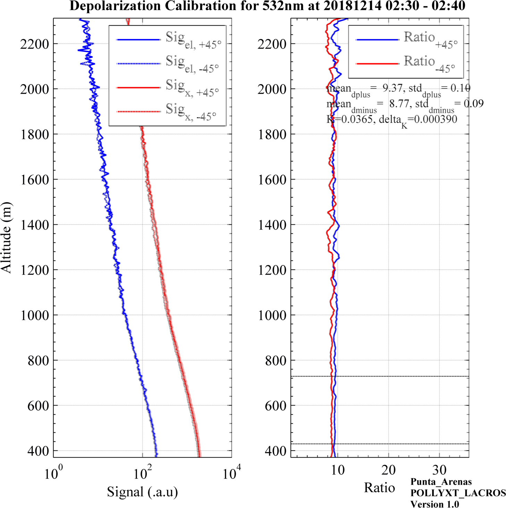
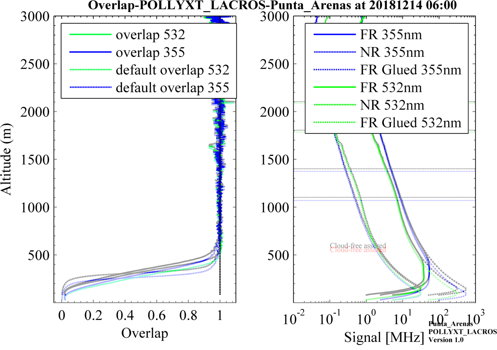

# PollyNET Processing Program

  - [Description](#description)
  - [Installation](#Installation)
  - [Workflow](#workflow)
  - [Algorithm](#algorithm)
    - [saturation detection](#saturation-detection)
  - [Products](#products)
  - [Error Analysis](#error-analysis)
  - [Visualization](#visualization)
  - [Howto](#howto)
    - [How to add a new polly process function](#How-to-add-a-new-polly-process-function)
    - [How to add a new defaults file](#How-to-add-a-new-defaults-file)
    - [How to add a new water vapor calibration instrument](#How-to-add-a-new-water-vapor-calibration-instrument)
  - [Appendix](#appendix)
    - [Variables](#variables)
      - [data](#data)
      - [taskInfo](#taskinfo)
      - [campaignInfo](#campaigninfo)
      - [processInfo](#processinfo)
    - [polly_config](#polly-config)
    - [pollynet_processing_chain_config](#pollynet-processing-chain-config)

### Description

This document will show you how the pollynet processing program works and how to add a new processing routine for new polly systems. Before your reading, we highly suggest you to turn to the paper "The automated multiwavelength Raman polarization and water-vapor lidar PollyXT: the neXT generation" to have a general idea about **PollyXT**.

### Installation

#### Requirements

- **MATLAB**

Before you download and install the **pollynet_processing_program**, make sure you've installed `MATLAB 2014a` and `python3` in your development machine. Because nearly all the code was based on **MATLAB** and some part of the data visualization is based on **python3** and python packages of **matplotlib**, **numpy** and **scipy**. 

To install `MATLAB`, you may need to contact with your IT department or find detailed information in the MATLAB official webpage (https://de.mathworks.com/help/install/index.html?s_tid=srctitle). 

- **python** and python packages

An convenient way to install all of these is to download the [Anaconda](https://www.google.com/url?sa=t&rct=j&q=&esrc=s&source=web&cd=3&ved=2ahUKEwiV8sS5_sfjAhVM3qQKHePpAZQQFjACegQICBAB&url=https%3A%2F%2Fconda.io%2Fdocs%2Fuser-guide%2Finstall%2Fdownload.html&usg=AOvVaw3pmqgYKVkcF28EUZaVftcT). **Anaconda** is a standard platform for Python data science. Therefore, it will get everything ready for python once you installed it.

After you've installed the dependences, you can check it with using linux command `which`

<center>

<br>
<b>
check matlab and python dependence
</b>
</center>

#### Download

The whole program was mangaged with GitHub. You can download it through (make sure `git` was installed in your local environment)

``` bash
git clone https://github.com/ZPYin/Pollynet_Processing_Chain
```
<center>

<br>
<b>
download Pollynet_Processing_Chain
</b>
</center>

After you downloaded the code, you can find the folder structure of the code base as below,

<center>

<br>
<b>
folder structure of Pollynet_Processing_Chain
</b>
</center>

#### setup

The repository you've downloaded has not been configured yet. You need to tell it which kind of polly data you want to process. This is achieved through setting up entries in the [**link**](../config/template_pollynet_processing_chain_link.txt) file. Since **polly** has been upgraded after many years, the system configuration could also be different. Therefore, you need to specify the settings for the polly. This can be done by setting up new polly configuration file, which is names as [**polly_config.json**](../config/template_polly_config.json).

1. Finish the global settings with following the example of [**template_pollynet_processing_chain_config.json**](../config/template_pollynet_processing_chain_config.json). The better way is just changing this file with your own preferences and requirements.
2. Configure the polly processing settings with creating a json file, naming {polly}_config_{date}.json. Write in the polly settings with the help from the [**template_polly_config.json**](../config/template_polly_config.json).
3. Add the entry to the processing program with adding a new line in [**template_pollynet_processing_chain_link.txt**](../config/template_pollynet_processing_chain_link.txt). For each polly data, it will search the processing settings in this history file. If no history was found, the polly data will be neglected.
4. Add the polly campaign history in the **/todo_filelist/pollynet_history_of_places_new.txt**.

### Workflow

<center>

<br>
<b>
flowchart of Pollynet_Processing_Chain
</b>
</center>

Top is the flowchart of the processing program. It includes three main processing parts, create processing task, find processing function and activate processing.

The [fileinfo_new.txt](../todo_filelist/fileinfo_new.txt) is generated by top-level function which is controlled by our pollynet website maintainers. In this file, there contains the folder and file of the stored polly raw data, instrument label, data size and so on. For processing program, the data file is necessary to start a processing task and the instrument label is used to search for the proper running configurations. (The configurations of different polly can be found in [pollynet.md](pollynet.md)). In the fileinfo_new.txt, each row content stands for a new task. All the task related info will be saved in [taskInfo](#taskinfo)

Every polly lidar system is not stationary system. It is either container based or box-based which can be transferred to remote locations. PollyNET is aimed at measuring the aerosol distribution globally and the same lidar instrument can join different campaigns. The history campaign info can be loaded by searching the information stored in [pollynet_history_of_places_new.txt](../todo_filelist/pollynet_history_of_places_new.txt). After that, we can got the polly data file, polly version and location info. These info will be saved in [campaignInfo](#campaigninfo). With these info, we can search the predefined polly configuration, defaults and precessing function file by looking through [pollynet_processing_config_history.txt](../config/pollynet_processing_config_history.txt). Detailed information about polly configuration and defaults can be found in [polly_config.md](polly_config.md) and [polly_defaults.md](polly_defaults.md).

Then it will active the processing chain for the stored polly data. As different polly system can provide different products and in the future the newly built polly system can even provide some extradinary products which we could never imagine, therefore it's better not to keep the processing flowchart fixed. In the figure above, only the typical processing flow of pollyxt is displayed. But we should keep in mind, it can be super easy to be extended as the way you like. Regarding to how to make it extended, please go to [Howto](#How-to-add-a-new-polly-process-function).

#### read polly data

For a normal processing function, it will start with reading the polly raw data. At present, all the data is stored in [netcdf](https://www.unidata.ucar.edu/software/netcdf/docs/) format. MATLAB has provided with a lot of netcdf functions which can help you have a quick look inside the data file. Also you can follow the [read function](../lib/polly_read_rawdata.m) in this repository. Remember all the data sharing in the program is via **data** struct. This can simplify the definition part of inputs and outputs for each processing function. But it will make the struct very complicated and swelling as the processing runs. You can find the detailed information about this struct in [here](#data).

#### signal preprocessing

**For the following parts, I will assume you have a lidar background.**

PMT in the lidar receiving part will convert the light signal into electric signal. And signal recorder will sample the electric current into digit data and save them in our storage disk. Basically, there are two ways to sample the signal, photon counting and AD conversion. They both have their limits and expertise. For our decades experiences, we found the photon counting is better for our polly systems. But for photon counting system, we need to dealing with [deadtime effects](https://en.wikipedia.org/wiki/Dead_time). 

Three different correction schemes are embedded in the preprocessing function. You can find the detailed information in [polly_config.md](polly_config.md). Although some of the deadtime effects can be corrected in some degree, we still want to warn the users not to apply the signal with Photon Count Rate above 70 MHz.

Then, we need to substract the background from the raw signal. The background can be calculated by using the pretriggering signal (1-250 bin for pollyxt system).

Also we will make a depol-calibration mask and fog mask by inspecting the angle of the polarizer and signal strength at certain height.

#### Depol-Calibration

For pollyxt systems, the depol-calibration is implemented by using the $\pm\Delta45°$ method. Polly will start serveral automatic calibration processes everyday. We can extract the calibration profiles by comparing the angle of the polarizer or we can pre-defined the calibration time in the configuration file (Default way).

<p align='center'>
  
  <br>
  <b>Depol-Calibration-Results</b>
</p>

#### cloud-screen

There are different ways to realize cloud-screen, gradient method, wavelet method, variance method and so on. No matter which kind of method you use, you have to set a threshold. In the program, I only used the gradient method with comparing the slope of range-corrected signal to the pre-defined threshold. We can control the filtering strength by using different thresholds. In the overlap estimation part, the results is highly sensible with cloud contamination. Therefore, we can decrease the threshold to further limit the filtering.

#### overlap estimation

There are two basic ways to estimate the overlap function for polly system. Firstly, using the Raman signal and tuning the overlap to achieve the convergence between Klett retrieving results and Raman retrieving results. But this method is controlled by the assumed lidar ratio and not easy to be implemented in an automatic way. Secondly, we can take advantage of the Near-Range and Far-Range channel, as the full overlap height for the Near-Range channel is only 120 m, we can easily estimate the overlap of Far-Range channel down to 120m by comparing the signal ratio between Near-Range and Far-Range signal.

<p align='center'>

<br>
<b>Overlap</b>
</p>

#### period-splitting

This part is used to split the continuous cloud-free profiles into several certain-length subgroups. The default length is 60 min.

#### read meteor data

This part is used to read the meteorological data. We have GDAS1 profiles in our server, which we can access with one-day delay. Therefore for realtime analysis, we need standard-atmosphere model data. Besides, an interface of reading radiosonde is also added to support the data analysis from Polarstern cruise.

#### rayleigh fitting

Rayleigh fitting part is used to search the reference height for aerosol retrieving. The philosophy is based on the similarity between the detected signal and pure molecular signal. Detailed information can be found in **Pollynet_Processing_Chain.pptx**

#### transmission correction

Normally, the transmission ratio of parallel and vertical polarized component is not 1. Therefore, the signal in the total channel does not strictly equal to elastic signal. You can find the correction formula in **dissertation_baars.pdf**.

#### klett and raman retrieving

You can find thousands of documents about the analysis of klett and raman method. Read one or two of them, then you can easily understand this part in the program.

#### water vapor calibration

The key about water vapor calibration is to find a standard instrument. For most of PollyNET site, you can find a collocated AERONET site. You can find the site by looking at [AERONET-station-list](AERONET-station-list.txt) or go to [AERONET website](https://aeronet.gsfc.nasa.gov/cgi-bin/type_one_station_opera_v2_new). Detailed information about the calibration method can be found in [Guangyao's paper](https://www.atmos-meas-tech.net/11/2735/2018/).

For LACROS campaign, there will be a good option by using the IWV from MWR. Because, MWR can provide nighttime measurement results which is ideal for water vapor calibration. You need to specify the folder of the MWR products to allow the program to read the IWV. Go to **pollyxt_lacros** to have a look.

#### lidar calibration

Lidar calibration is based on the Raman or Klett retrieving results. At present, overlap correction is not implemented, which means the klett method could suffer a strong overlap effect at the lower altitude. In the calibration part, we treat the blind area to be constant. This is a good assumption at most conditions, but we should keep in mind if there is low level aerosol layers, it will create very large deviations. So our priority is using the Raman results when it is available.

```
O'Connor method has been tested. But for the photon counting system, it's not so pratical due to deadtime effects. But we need to keep an eye on this, because this can complement the scope of the calibrated conditions.
```

### Algorithm

#### saturation detection

### Products

The program can generate 

#### retrieving results

#### depolarization calibration

#### water vapor calibration

#### lidar calibration

#### aerosol categorization

### Error Analysis

### Visualization

### Howto

#### How to add a new polly process function

You can follow the below steps to create a new process procedure for a new polly systems.

- add a new configuration file in config folder to save all the related configurations. You can copy the content from other similar polly systems to speed up this process
- add a default file in `/lib/pollyDefaults`. Don't forget to add the default overlap files.
- create a new folder, named with `{polly Version}_func_lib`. Write all the related processing functions inside or copy all the functions from the folder of other polly systems. If you copy all the functions from other folder, don't forget to change the function definitions inside.
- create a new main processing function in the root folder and name it with `pollynet_processing_chain_{polly version}.m`. Write all the processing part here.
- add a new entry in `/config/pollynet_processing_config_history.txt`.

#### How to add a new defaults file

#### How to add a new water vapor calibration instrument

### Appendix

#### Variables

##### data

```
data: struct
  rawSignal: matrix [channel×bin×time]
    raw signal from netcdf files. [Photon Count]
  mShots: matrix [channel×time]
    number of accumulated laser shots.
  mTime: array [time]
    date and time for each profile. [datenum]
  depCalAng: array [time]
    angle of the polarizer. [°]
  hRes: float
    spatial resolution. [m]
  zenithAng: float
    zenith angle of the whole system. [°]
  mSite: char
    location of the system.
  deadtime: matrix [channel×orders]
    parameters for deadtime correction which are stored in the netcdf file.
  lat: float
    latitude of measurement site. [degree]
  lon: float
    longtitude of measurement site. [degree]
  alt0: float
    altitude of measurement site. [m]
  monitorStatus: struct
    time: array
      date and time for each monitor data. [datenum]
    ExtPyro: array
      gauge data from ExtPyro. [mJ]
    Temp1064: array
      temperature of the PMT at 1064 channel. [°C]
    Temp1: array
      temperature of the emitting cabin. [°C]
    Temp2: array
      temperature of the receiving cabin. [°C]
    OutsideT: array
      ambient temperature. [°C]
    OutsideRH: array
      ambient relative humidity. [%]
    roof: array
      status of the roof.
    rain: array
      status of rain.
    shutter: array
      stauts of shutter.
  signal: matrix [channel×bin×time]
    background-substracted and deadtime corrected signal. [Photon Count]
  bg: matrix[channel×bin×time]
    background of each bin. [Photon Count]
  height: array
    height above ground. [m]
  alt: array
    altitude above mean sea level. [m]
  distance0: array
    tilted distance of each bin. [m]
  lowSNRMask: logical matrix [channel×bin×time]
    mask for low signal-noise ratio.
  depCalMask: array
    mask for depolarization calibration.
  fogMask: array
    mask for fog.
  flagSaturation: matrix [channel×bin×time]
    flag to show whether the bin is saturated by clouds.
  depol_cal_fac_532: float
    depolarization calibration factor at 532 nm.
  depol_cal_fac_std_532: float
    uncertainty of depolarization calibration factor at 532 nm.
  depol_cal_fac_355: float
    depolarization calibration factor at 355 nm.
  depol_cal_fac_std_355: float
    uncertainty of depolarization calibration factor at 355 nm.
  depCaliAttri: struct
    depCalAttri532 or depCalAttri355: struct
      sig_t_p: cell
        mean signal at total channel at positive calibration angle in each calibration period.
      sig_t_m: cell
        mean signal at total channel at negative calibration angle in each calibration period.
      sig_x_p: cell
        mean signal at cross channel at positive calibration angle in each calibration period.
      sig_x_m: cell
        mean signal at cross channel at negative calibration angle in each calibration period.
      caliHIndxRange: cell
        index of calibration range along the height axisinr each calibration period.
      indx_45m: cell
        index of the profiles at negative calibration angle in each calibration period.
      indx_45p: cell
        index of the profiles at positive calibration angle in each calibration period.
      dplus: cell
        signal ratio at positive calibration angle in each calibration period.
      dminus: cell
        signal ratio at negative calibration angle in each calibration period.
      segmentLen: cell
        segment length to calculate the mean value of signal ratioinr each calibration period.
      indx: cell
        index of the base index of the most stable spatial segment in each calibration period.
      mean_dplus_tmp: cell
        mean signal ratio at positive calibration angle at each calibration segment in each calibration period.
      std_dplus_tmp: cell
        uncertainty of signal ratio at positive calibration angle for all the calibration segments in each calibration period.
      mean_dminus_tmp: cell
        mean signal ratio at negative calibration angle at each calibration segment in each calibration period.
      std_dminus_tmp: cell
        uncertainty of signal ratio at negative calibration angle at each calibration segment in each calibration period.
      TR_t: cell
        Transmission ratio at total channel in each calibration period.
      TR_x: cell
        Transmission ratio at cross channel in each calibration period.
      segIndx: cell
        index of the most stable segment in each calibration period.
      thisCaliTime: cell
        date and time for each calibration period. [datenum]
  depol_cal_fac_532: array
    depolarization calibration factor at 532 nm for each calibration period.
  depol_cal_fac_std_532: array
    uncertainty of depolarization calibration factor at 532 nm for each calibration period.
  depol_cal_time_532: array
    date and time for each calibration period. [datenum]
  depol_cal_fac_355: array
    depolarization calibration factor at 355 nm for each calibration period.
  depol_cal_fac_std_355: array
    uncertainty of depolarization calibration factor at 355 nm for each calibration period.
  depol_cal_time_355: array
    date and time for each calibration period. [datenum]
  flagCloudFree2km: logical array
    flag to show whether it's cloud-free below 2 km.
  flagCloudFree8km: logical array
    flag to show whether it's cloud-free below 8 km.
  overlap532: array
    the estimated overlap function for 532 Far-Range channel.
  flagOverlapUsedDefault532: logical
    flag to show whether the overlap at 532 nm is the default overlap.
  overlap355: array
    the estimated overlap function for 355 Far-Range channel.
  flagOverlapUsedDefault355: logical
    flag to show whether the overlap at 355 nm is the default overlap.
  cloudFreeGroups: matrix [group×2]
    start and end index of each cloud-free group.
  temperature: matrix [group×bin]
    temperature at each range bin for each cloud-free group. [°C]
  pressure: matrix [group×bin]
    pressure at each range bin for each cloud-free group. [hPa]
  relh: matrix [group×bin]
    relative humidity at each range bin for each cloud-free group. [%]
  meteorAttri: struct
    dataSource: cell
      data source of meteorological data for each cloud-free group.
    URL: cell
      URL for meteorological data for each cloud-free group. [URL or directory]
    datetime: array
      date and time for the applied meteorological data at each cloud-free group.
  AERONET: struct
    datetime: array
      date and time for each AERONET results.
    AOD_{wavelength}: array
      AOD at certain wavelength.
    wavelength: array
      wavelength of each channel. [nm]
    IWV: array
      Integral water vapor. [kg*m^{-2}]
    angstrexp440_870: array
      Å 440-870nm.
    AERONETAttri: struct
      URL: char
        URL for accessing the AERONET data.
      level: char
        product level.
      status: int
        the retrieving stauts for the data. 0 means no successful access.
      IWVUnit: char
        unit for IWV.
      location: char
        location for the current measurement.
      PI: char
        PI for the current AERONET site.
      contact: char
        contact of PI.
  refHIndx355: matrix [group×bin]
    index of reference height at 355 nm for each cloud-free group.
  refHIndx532: matrix [group×bin]
    index of reference height at 532 nm for each cloud-free group.
  refHIndx1064: matrix [group×bin]
    index of reference height at 1064 nm for each cloud-free group.
  dpIndx{wavelength}: cell
    index of douglas-peucker decomposed points for each cloud-free signal profile.
  el{wavelength}: matrix [bin×time]
    elastic signal. [Phtoton Count]
  bgEl{wavelength}: matrix [bin×time]
    background of elastic signal. [Photon Count]
  aerBsc{wavelength}_{method}: matrix [group×bin]
    aerosol backscatter coefficients. [m^{-1}*Sr^{-1}]
  aerExt{wavelength}_{method}: matrix [group×bin]
    aerosol extinction coefficients. [m^{-1}]
  LR{wavelength}_raman: matrix [group×bin]
    aerosol lidar ratio retrieved by raman method. [Sr]
  LR{wavelength}_aeronet: array [group]
    aerosol ldiar ratio retrieved by constrained-AOD klett method. [Sr]
  voldepol{wavelength}_{method}: matrix [group×bin]
    volume depolarization ratio at each cloud-free group with the same smoothing for the corresponding backscatter.
  pardepol{wavelength}_{method}: matrix [group×bin]
    particle depolarization ratio.
  pardepolStd{wavelength}_{method}: matrix [group×bin]
    uncertainty of particle depolarization ratio.
  flagDefaultMoldepol{wavelength}: array
    flag to show whether the used molecule depolarization ratio is from default settings.
  moldepol{wavelength}: array [group]
    molecule depolarization ratio.
  moldepolStd{wavelength}: array [group]
    uncertainty of molecule depolarization ratio.
  ang_{bsc,ext}_{wavelength}_{method}: matrix [group×bin]
    Ångstroem exponent.
  IWV: array
    Integrated water vapor from lidar measurements for each cloud-free groups. [kg*m^{-2}]
  IWVAttri: struct
    source: char
      data source of IWV.
    site: char
      site of the external instrument.
    datetime: array
      date and time for the used IWV from external instrument for each water vapor calibration period.
    PI: char
      PI for the external instrument.
    contact: char
      contact of PI.
  wvconstUsed: float
    applied water vapor calibration constant in the processing. [g*kg^{-1}]
  wvconstUsedStd: float
    Uncertainty of the applied water vapor calibration constant in the processing. [g*kg^{-1}]
  wvconstUsedInfo: struct
    flagCalibrated: int
      flag to show whether there is a successful calibration.
    IWVInstrument: char
      data source for the external instrument.
    nIWVCali: int
      number of successful water vapor calibration periods.
  wvmr: matrix [group×bin]
    water vapor mixing ratio profile for each cloud-free group. [g*kg^{-1}]
  rh: matrix [group×bin]
    relative humidity for each cloud-free group. [%]
  wvmr: matrix [bin×time]
    high resolved water vapor mixing ratio profiles. [g*kg^{-1}]
  rh: matrix [bin×time]
    high resolved relative humidity profiles. [%]
  LC: struct
    LC_{method}_{wavelength}: array
      lidar calibration constants. This constant is calibrated for each 30-s resolved profile.
  LCUsed: struct
    LCUsed{wavelength}: float
      appiled lidar constant.
    LCUsedTage{wavelength}: int
      lidar constant status. 
        0: 'no calibration'; 
        1: klett method; 
        2: raman method; 
        3: defaults
    flagLCWarning{wavelength}: int
      whether there is a strong fluctuation of the lidar constants.
  att_beta_{wavelength}: matrix [bin×time]
    attenuated backscatter. [m^{-1}*Sr^{-1}]
  quasi_par_beta_{wavelength}{_V2}: matrix [bin×time]
    quasi particle backscatter coefficient. [m^{-1}*Sr^{-1}]
  volDepol_{wavelength}: matrix [bin×time]
    high resolved volume depolarization ratio profile.
  quasi_parDepol_532{_V2}: matrix [binxtime]
    high resolved particle depolarization ratio profile.
  quasi_ang_532_1064{_V2}: matrix [bin×time]
    quasi Ångstroem exponent 532-1064.
  quality_mask_{wavelength}{_V2}: matrix [bin×time]
    signal quality mask. This mask is calculated with the smoothed signal. 
      0: good signal; 
      1: low SNR; 
      2: depolarization calibration
  quasiAttri{_V2}: struct
    flagGDAS1: int
      flag to show whetehr GDAS1 data was used.
    timestamp: float
      time stamp of the appled GDAS1 data.
    meteorDataSource: str
      meteorological data type. 
      e.g., 'gdas1', 'standard_atmosphere', 'websonde', 'radiosonde'
  tc_mask: matrix [bin×time]
    target classification mask.
      0: No signal; 
      1: Clean atmosphere; 
      2: Non-typed particles/low conc.; 
      3: Aerosol: small; 
      4: Aerosol: large, spherical; 
      5: Aerosol: mixture, partly non-spherical; 
      6: Aerosol: large, non-spherical; 
      7: Cloud: non-typed; 
      8: Cloud: water droplets; 
      9: Cloud: likely water droplets; 
      10: Cloud: ice crystals; 
      11: Cloud: likely ice crystals  
```

##### defaults

```
defaults: struct
  depolCaliConst{wavelength}: float
    default depolariazation constant.
  depolCaliConstStd{wavelength}: float
    default uncertainty of depolarization constant.  
  LC: array
    lidar constant for each channel.
  LCStd: array
    uncertainty of lidar constant.
  overlapFile{wavelength}: char
    absolute directory of the default overlap file. 
  molDepol{wavelength}: float
    molecule depolarization ratio.
  molDepolStd{wavelength}: float
    uncertainty of molecule depolarization ratio.
  wvconst: float
    water vapor calibration constant. [g*kg^{-1}]
  wvconstStd: float
    uncertainty of water vapor calibration constant. [g*kg^{-1}]
```

##### taskInfo

```
taskInfo: struct
  todoPath: char
    the todo path which saves the polly data and fileinfo_new.txt
  dataPath: char
    the relative folder of the polly data to the todo path.
  dataFilename: char
    filename of the polly data. You can construct the absolute path of the polly data by combining todoPath, dataPath and dataFilename.
  zipFile: char
    filename of the zipped polly data.
  dataSize: single
    the size of the polly data file.
  pollyVersion: char
    polly version. Detailed information can be found in [polly version](pollynet.md)
  startTime: float
    start time for processing the task. [datenum]
  dataTime: float
    date and time for the creation of the current polly data. [datenum]
```

##### campaignInfo

```
campaignInfo: struct
  name: char
    polly version. Detailed information can be found in [polly version](pollynet.md)
  location: char
    location of the current measurement campaign. Detailed information can be found in [pollynet history info](../todo_filelist/pollynet_history_of_places_new.txt)
  startTime: float
    start time for the current campaign. [datenum]
  endTime: float
    end time for the current campaign. [datenum]
  lon: float
    longitude of the campaign. [°]
  lat: float
    latitude of the campaign. [°]
  asl: float
    height above average sea level. [m]
  depolConst: float
    depolarization constant for 532 nm.
  molDepol: float
    molecule depolarization ratio for 532 nm.
  caption: char
    some description about the campaign.
```

##### processInfo

```
processInfo: struct
  fileinfo_new: char
    filename of the fileinfo_new.txt. This is the collection of all present polly data from PollyNER which is waited for processing.
  doneListFile: char
    done list file which contains all the information of generated figures by the program.
  pollynet_history_of_places_new: char
    pollynet history file which contains all the history information about different finished or ongoing campaigns.
  log_folder: char
    folder to save the log file.
  gdas1_folder: char
    the root folder of GDAS1 profiles.
  defaultsFile_folder: char
    folder of defaults files.
  results_folder: char
    folder to save the processing results and calibration results.
  pic_folder: char
    folder to save the figures.
  pollynet_config_history_file: char
    history file to log all the configuration files, defaults_reading function and processing function for all polly systems.
  minDataSize: int32
    Mininmum data size that was accepted for the data processing.
  institue: char
    institute full-name. This will be written to the nc files.
  contact: char
    contact. This will be written to the nc files.
  homepage: char
    pollynet home page. This will be written to the nc files.
  programVersion: char
    program version. This will be written to the nc files.
  visualizationMode: char
    visualization mode, 'matlab' or 'python'. Python is better supported in the server than matlab.
  pyBinDir: char
    path for the appled python interpreter.
	flagEnableCaliResultsOutput: logical
    flag bit to control whehter to output the calibration results
  flagReduceMATLABToolboxDependence: logical
    flag bit to control whether to use the matlab toolbox (statistical toolbox and curveture toolbox)
  flagDeleteData: logical
    flag bit to control whether to delete the data file after finishing the processing.
  flagEnableResultsOutput: logical
    flag bit to control whether to save the processing results.
  flagEnableDataVisualization: logical
    flag bit to control whether to visualize the results.
  flagSendNotificationEmail: logical
    flag bit to control whether to send email to the admin for each running task.
```

##### done_filelist

|ident|Name|
|:---:|:---|
|ANGEXP_Raman|     averaged angström exponent profile|
|ANGEXP|     averaged angström exponent profile|
|ANGEXP_Klett|     averaged angström exponent profile|
|~~Bsc~~ Bsc_AERONET|     averaged backscatter profile from AOD-Constrained method|
|Bsc_Klett|     averaged backscatter profile from Klett method|
|Bsc_Raman|     averaged backscatter profile from Raman method|
|~~DepRatio~~|     averaged depolarization ratio profile|
|DepRatio_Raman|     averaged depolarization ratio profile|
|DepRatio_Klett|     averaged depolarization ratio profile|
|Ext_Klett|     averaged extinction profile from Klett method|
|Ext_Raman|     averaged extinction profile from Raman method|
|~~Ext_Klett~~ Ext_AERONET|     averaged extinction profile from AOD-Constrained method|
|LR|     averaged lidar ratio profile|
|Meteor_P|     averaged pressure profile from input|
|SIG|     averaged range-corrected signals|
|RH_av|     averaged relative humidity profile|
|Meteor_T|     averaged temperature profile from input|
|WVMR_av|     averaged water vapour mixing ratio profile|
|ATT_BETA_1064|     Calibrated attenuated backscatter coefficient at 1064 nm|
|ATT_BETA_355|     Calibrated attenuated backscatter coefficient at 355 nm|
|ATT_BETA_532|     Calibrated attenuated backscatter coefficient at 532 nm|
|monitor|     houskeeping data|
|LC_1064|     Lidar constant of 1064 FR channel|
|LC_1064_NF|     Lidar constant of 1064 NR channel|
|LC_355|     Lidar constant of 355 FR channel|
|LC_355_NF|     Lidar constant of 355 NR channel|
|LC_532|     Lidar constant of 532 FR channel|
|LC_532_NF|     Lidar constant of 532 NR channel|
|TC|     Lidar Target Categoriaztion|
|Quasi_ANGEXP_532_1064|     Quasi angström exponent 532/1064 nm|
|Quasi_Bsc_1064|     Quasi particle backscatter coefficient at 1064 nm|
|Quasi_Bsc_355|     Quasi particle backscatter coefficient at 355 nm|
|Quasi_Bsc_532|     Quasi particle backscatter coefficient at 532 nm|
|Quasi_PDR_532|     Quasi particle depolarization ratio at 532 nm|
|RCS_FR_1064|     Range-corrected signal far-range at 1064 nm|
|RCS_FR_355|     Range-corrected signal far-range at 355 nm|
|RCS_FR_532|     Range-corrected signal far-range at 532 nm|
|RCS_NR_355|     Range-corrected signal near-range at 355 nm|
|RCS_NR_532|     Range-corrected signal near-range at 532 nm|
|RH|     relative humidity|
|overlap|     Retrieved overlap function of the channels|
|SAT_NR_1064|     Signal status FR 1064 nm|
|SAT_FR_1064|     Signal status FR 1064 nm|
|SAT_NR_355|     Signal status FR 355 nm|
|SAT_FR_355|     Signal status FR 355 nm|
|SAT_FR_532|     Signal status FR 532 nm|
|SAT_NR_532|     Signal status FR 532 nm|
|VDR_1064|     Volume depolarization ratio at 1064 nm|
|VDR_355|     Volume depolarization ratio at 355 nm|
|VDR_532|     Volume depolarization ratio at 532 nm|
|WVMR|     water vapour mixing ratio |
|LT_CaliRes| long term lidar calibration results|

#### polly config

Detailed information can be found in [polly_config](../doc/polly_config.md)

#### pollynet processing chain config

Detailed information can be found in [pollynet_processing_chain_config](../doc/pollynet_processing_chain_config.md)