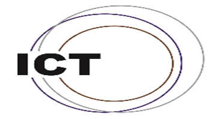
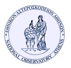

# PollyNET Automatic Processing Program
  

This repository contains the matlab codes for processing and visualizing the data from [PollyNET](/doc/pollynet.md) automatically. This network consists of novel multiwavelength raman polarization lidars around the world, like Haifa Isreal, Beijing China and Punta-Arenas Chile. The lidar system is maintained and updated in the past 30 years. It can monitor the tiny floated particles and water vapor in the atmosphere. For the most advanced version - [PollyXT](https://www.atmos-meas-tech.net/9/1767/2016/), it has 12 channels, including 8 far-range channels and 4 near-range channels. It can deliver the 3β+2α+2S information and also about the water vapor mixing ratio profile if calibrated carefully.

As the development of PollyNET, the data accumulated dramatically and the realtime dataflow can be as large as ~ GB. Therefore, the automatic processing program is essential for translating the information about aerosol distribution, transportation and aerosol-cloud interaction simultaneously from the lidar recorded lidar. The program in this repository can automatically calibrate the lidar depolarization, total and water vapor channels, retrieving 1-h averaged cloud-free profiles of aerosol intensive properties and categorizing the aerosol groups with [aerosol target classification algorithm](https://www.atmos-meas-tech.net/10/3175/2017/).

**Documentation**: https://pollynet.github.io/Pollynet_Processing_Chain/

### Authors

- [Zhenping Yin](mailto:zp.yin@whu.edu.cn)
- [Holger Baars](mailto:baars@tropos.de)

### Acknowledgements

- matlab [export_fig](https://de.mathworks.com/matlabcentral/fileexchange/23629-export_fig) package by Yair Altman
- matlab [Standard Atmosphere Calculator](https://de.mathworks.com/matlabcentral/fileexchange/8799-standard-atmosphere-calculator) by Richard Rieber
- ideas from python [lidar_molecular](https://bitbucket.org/iannis_b/lidar_molecular/downloads) by Ioannis Binietoglou
- matlab [JSONlab](https://de.mathworks.com/matlabcentral/fileexchange/33381-jsonlab-a-toolbox-to-encode-decode-json-files) by Qianqian Fang
- ceilometer matlab programs from [Birgit Heese](https://www.tropos.de/institut/ueber-uns/mitarbeitende/birgit-heese/)

### Cooperation

   
   
   
   
   
   
   
   
   
   
   

